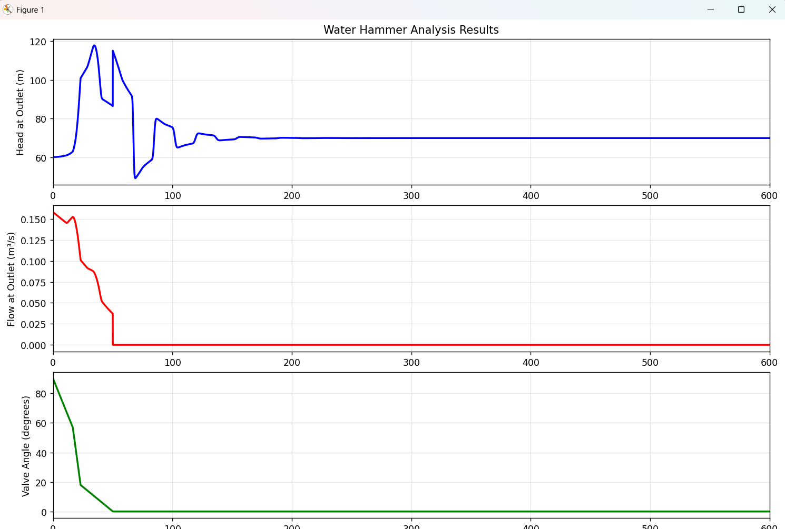

# Water_Hammer_MOC
1D Water Hammer Analysis using Method of Characteristics (MOC) in Python. Solves hyperbolic PDEs for pressure wave propagation in pipelines. 
Features valve closure modeling, realistic boundary conditions, friction effects, and wave reflections. Built from first principles for process engineers.

# Limitations and Capablites
The current capabilites and limitations of this program are as follows
- Single pipeline transient analysis: Currently the program is capable of modelling only one pipe, extending to network requires explicitly solving multiple ODEs at once.
- Valve closure modelling: The program is currently designed for modelling valve closure - both rapid and gradual, and allows for users to input valve characteristics to model valve closure as realistically as possible. A future module for modelling pump stops and trips will be implemented at a later date.
- Real-time visualization of pressure waves: Graphs showing pressure profile at outlet across time, valve opening % and flowrate acrosss time.
  
- Solver may take a while to compute for long simulations, for example a slow valve closure. The intention is to optimize looping and calculation to drastically reduce solve times, though this will occur at a future date.
- 

# References

The following are useful references both for understanding WaterHammer and for developing and implementing the key MOC charactersitics equations:

Wylie, E.B. and Streeter, V.L. (1993). Fluid Transients in Systems. Prentice Hall.
Chaudhry, M.H. (2014). Applied Hydraulic Transients (3rd ed.). Springer.
Ghidaoui, M.S. et al. (2005). "A Review of Water Hammer Theory and Practice." Applied Mechanics Reviews, 58(1), 49-76.
Hydraulic Transient In A Pipeline Using Computer Model to Calculate and Simulate Transient (2007)” by Mosab Elbashir and Samuel Amoah

The final reference is particuarly useful for understanding the program code as it contains FORTRAN code of the MOC equations which was used to help develop the code in this Python program.
